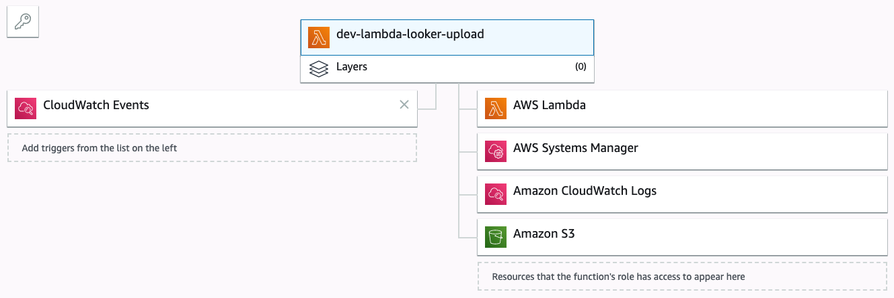

# terraform-aws-lambda-looker
Simple Terraform deployment of a Lambda function that exports a Looker view to S3


## Terraform initialization

```bash
╭─ ~/code/terraform-aws-lambda-looker $
╰─ terraform init

Initializing provider plugins...
- Checking for available provider plugins on https://releases.hashicorp.com...
- Downloading plugin for provider "aws" (2.10.0)...

The following providers do not have any version constraints in configuration,
so the latest version was installed.

To prevent automatic upgrades to new major versions that may contain breaking
changes, it is recommended to add version = "..." constraints to the
corresponding provider blocks in configuration, with the constraint strings
suggested below.

* provider.aws: version = "~> 2.10"

Terraform has been successfully initialized!

You may now begin working with Terraform. Try running "terraform plan" to see
any changes that are required for your infrastructure. All Terraform commands
should now work.

If you ever set or change modules or backend configuration for Terraform,
rerun this command to reinitialize your working directory. If you forget, other
commands will detect it and remind you to do so if necessary.
```

## Terraform plan

```bash
╭─ ~/code/terraform-aws-lambda-looker $
╰─ terraform plan
Refreshing Terraform state in-memory prior to plan...
The refreshed state will be used to calculate this plan, but will not be
persisted to local or remote state storage.


------------------------------------------------------------------------

An execution plan has been generated and is shown below.
Resource actions are indicated with the following symbols:
  + create

Terraform will perform the following actions:

  + aws_cloudwatch_event_rule.cloudwatch-event-rule-midnight-run
      id:                             <computed>
      arn:                            <computed>
      description:                    "Cloudwatch event rule to run every day at midnight for the Looker upload."
      is_enabled:                     "true"
      name:                           "dev-cloudwatch-event-rule-midnight-run-looker-upload"
      schedule_expression:            "cron(0 0 * * ? *)"

  + aws_cloudwatch_event_target.cloudwatch-event-target
      id:                             <computed>
      arn:                            "arn:aws:lambda:eu-west-1:848373817713:function:dev-lambda-looker-upload"
      rule:                           "dev-cloudwatch-event-rule-midnight-run"
      target_id:                      <computed>

  + aws_iam_role.role-lambda
      id:                             <computed>
      arn:                            <computed>
      assume_role_policy:             "{\n  \"Version\": \"2012-10-17\",\n  \"Statement\": [\n    {\n      \"Action\": \"sts:AssumeRole\",\n      \"Principal\": {\n        \"Service\": \"lambda.amazonaws.com\"\n      },\n      \"Effect\": \"Allow\",\n      \"Sid\": \"\"\n    }\n  ]\n}\n"
      create_date:                    <computed>
      description:                    "Role to execute all Lambda related tasks."
      force_detach_policies:          "false"
      max_session_duration:           "3600"
      name:                           "dev-jwat-role-lambda"
      path:                           "/"
      unique_id:                      <computed>

  + aws_iam_role_policy.policy-lambda
      id:                             <computed>
      name:                           "dev-jwat-policy-lambda"
      policy:                         "{\n  \"Version\": \"2012-10-17\",\n  \"Statement\": [\n    {\n      \"Effect\": \"Allow\",\n      \"Action\": [\n        \"lambda:InvokeFunction\",\n        \"logs:CreateLogGroup\",\n        \"logs:CreateLogStream\",\n        \"logs:PutLogEvents\",\n        \"ssm:GetParameter\",\n        \"s3:PutObject\",\n        \"s3:ListBucket\",\n        \"s3:GetObject\"\n      ],\n      \"Resource\": [\n        \"*\"\n      ]\n    }\n  ]\n}\n"
      role:                           "${aws_iam_role.role-lambda.id}"

  + aws_lambda_function.lambda-function
      id:                             <computed>
      arn:                            <computed>
      description:                    "Lambda function for uploading a Looker view"
      filename:                       "sources/lambda-functions/looker-upload/lambda.zip"
      function_name:                  "dev-lambda-looker-upload"
      handler:                        "lambda.handler"
      invoke_arn:                     <computed>
      last_modified:                  <computed>
      memory_size:                    "128"
      publish:                        "false"
      qualified_arn:                  <computed>
      reserved_concurrent_executions: "-1"
      role:                           "${aws_iam_role.role-lambda.arn}"
      runtime:                        "python3.7"
      source_code_hash:               <computed>
      source_code_size:               <computed>
      tags.%:                         "2"
      tags.Environment:               "Development"
      tags.Owner:                     "Jitse-Jan"
      timeout:                        "3"
      tracing_config.#:               <computed>
      version:                        <computed>

  + aws_lambda_permission.lambda-permission-cloudwatch
      id:                             <computed>
      action:                         "lambda:InvokeFunction"
      function_name:                  "dev-lambda-looker-upload"
      principal:                      "events.amazonaws.com"
      source_arn:                     "arn:aws:events:eu-west-1:848373817713:rule/dev-cloudwatch-event-rule-midnight-run-looker-upload"
      statement_id:                   "AllowExecutionFromCloudWatch"

  + aws_s3_bucket.bucket-lambda-deployments
      id:                             <computed>
      acceleration_status:            <computed>
      acl:                            "public-read"
      arn:                            <computed>
      bucket:                         "dev-jwat"
      bucket_domain_name:             <computed>
      bucket_regional_domain_name:    <computed>
      force_destroy:                  "false"
      hosted_zone_id:                 <computed>
      region:                         "eu-west-2"
      request_payer:                  <computed>
      tags.%:                         "2"
      tags.Environment:               "Development"
      tags.Owner:                     "Jitse-Jan"
      versioning.#:                   "1"
      versioning.0.enabled:           "true"
      versioning.0.mfa_delete:        "false"
      website_domain:                 <computed>
      website_endpoint:               <computed>


Plan: 7 to add, 0 to change, 0 to destroy.

------------------------------------------------------------------------

Note: You didn't specify an "-out" parameter to save this plan, so Terraform
can't guarantee that exactly these actions will be performed if
"terraform apply" is subsequently run.
```

## Terraform deploy

```bash
╭─ ~/code/terraform-aws-lambda-looker $ 
╰─ ./deploy.sh
[1/3] Creating packages for Lambda
> Checking for Lambda functions in /Users/j.waterschoot/code/terraform-aws-lambda-looker/sources/lambda-functions
>> Zipping /Users/j.waterschoot/code/terraform-aws-lambda-looker/sources/lambda-functions/looker-upload
Collecting certifi==2019.3.9 (from -r requirements.txt (line 1))
  Downloading https://files.pythonhosted.org/packages/60/75/f692a584e85b7eaba0e03827b3d51f45f571c2e793dd731e598828d380aa/certifi-2019.3.9-py2.py3-none-any.whl (158kB)
Collecting lookerapi==3.0.0 (from -r requirements.txt (line 2))
  Downloading https://files.pythonhosted.org/packages/5e/b5/49ecd3c4c86803e62e24ee206681e64820e24ab289b3d8496db98a073c60/lookerapi-3.0.0-py3-none-any.whl (687kB)
Collecting python-dateutil==2.8.0 (from -r requirements.txt (line 3))
  Downloading https://files.pythonhosted.org/packages/41/17/c62faccbfbd163c7f57f3844689e3a78bae1f403648a6afb1d0866d87fbb/python_dateutil-2.8.0-py2.py3-none-any.whl (226kB)
Collecting six==1.12.0 (from -r requirements.txt (line 4))
  Downloading https://files.pythonhosted.org/packages/73/fb/00a976f728d0d1fecfe898238ce23f502a721c0ac0ecfedb80e0d88c64e9/six-1.12.0-py2.py3-none-any.whl
Collecting urllib3==1.24.2 (from -r requirements.txt (line 5))
  Downloading https://files.pythonhosted.org/packages/df/1c/59cca3abf96f991f2ec3131a4ffe72ae3d9ea1f5894abe8a9c5e3c77cfee/urllib3-1.24.2-py2.py3-none-any.whl (131kB)
Installing collected packages: certifi, lookerapi, python-dateutil, six, urllib3
Successfully installed certifi-2019.3.9 lookerapi-3.0.0 python-dateutil-2.8.0 six-1.12.0 urllib3-1.24.2
You are using pip version 19.0.3, however version 19.1.1 is available.
You should consider upgrading via the 'pip install --upgrade pip' command.
[2/3] Deploying on AWS
aws_s3_bucket.bucket-lambda-deployments: Refreshing state... (ID: dev-jwat)
aws_cloudwatch_event_target.cloudwatch-event-target: Refreshing state... (ID: dev-cloudwatch-event-rule-midnight-run-...d-terraform-20190513083217509800000001)
aws_iam_role.role-lambda: Refreshing state... (ID: dev-jwat-role-lambda)
aws_lambda_permission.lambda-permission-cloudwatch: Refreshing state... (ID: AllowExecutionFromCloudWatch)
aws_cloudwatch_event_rule.cloudwatch-event-rule-midnight-run: Refreshing state... (ID: dev-cloudwatch-event-rule-midnight-run-looker-upload)
aws_lambda_function.lambda-function: Refreshing state... (ID: dev-lambda-looker-upload)
aws_iam_role_policy.policy-lambda: Refreshing state... (ID: dev-jwat-role-lambda:dev-jwat-policy-lambda)

Apply complete! Resources: 0 added, 0 changed, 0 destroyed.
[3/3] Executing the initial run script
> Running function `dev-lambda-looker-upload`.
< Response: {'ResponseMetadata': {'RequestId': '1d492f55-78c4-47c2-921a-a27cf784d4b0', 'HTTPStatusCode': 200, 'HTTPHeaders': {'date': 'Mon, 13 May 2019 08:40:36 GMT', 'content-type': 'application/json', 'content-length': '123', 'connection': 'keep-alive', 'x-amzn-requestid': '1d492f55-78c4-47c2-921a-a27cf784d4b0', 'x-amz-function-error': 'Unhandled', 'x-amzn-remapped-content-length': '0', 'x-amz-executed-version': '$LATEST', 'x-amzn-trace-id': 'root=1-5cd92d84-d306a2215d6228179c96cb04;sampled=0'}, 'RetryAttempts': 0}, 'StatusCode': 200, 'FunctionError': 'Unhandled', 'ExecutedVersion': '$LATEST', 'Payload': <botocore.response.StreamingBody object at 0x10ea5ceb8>}
```

## AWS overview

### Lambda functions


### Lambda function detail


### Cloudwatch event


### Cloudwatch rule


